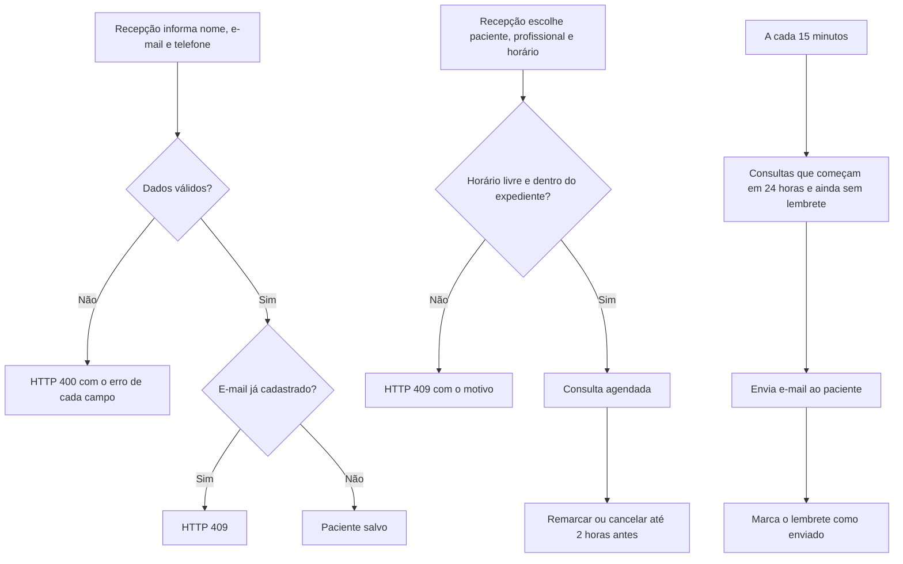

# Fluxo

```mermaid
%% ====
%% AGENDA CLÍNICA
%% 1. Cadastro de pacientes
flowchart TD
  P0[Recepção informa nome, e-mail e telefone] --> P1{Dados válidos?}
  P1 -- Não --> P2[HTTP 400 com o erro de cada campo]
  P1 -- Sim --> P3{E-mail já cadastrado?}
  P3 -- Sim --> P4[HTTP 409]
  P3 -- Não --> P5[Paciente salvo]
%% 2. Agendamento de consultas
  A0[Recepção escolhe paciente, profissional e horário] --> A1{Horário livre e dentro do expediente?}
  A1 -- Não --> A2[HTTP 409 com o motivo]
  A1 -- Sim --> A3[Consulta agendada]
  A3 --> A4[Remarcar ou cancelar até 2 horas antes]
%% 3. Lembretes por e-mail
  L0[A cada 15 minutos] --> L1[Consultas que começam em 24 horas e ainda sem lembrete]
  L1 --> L2[Envia e-mail ao paciente]
  L2 --> L3[Marca o lembrete como enviado]
```
