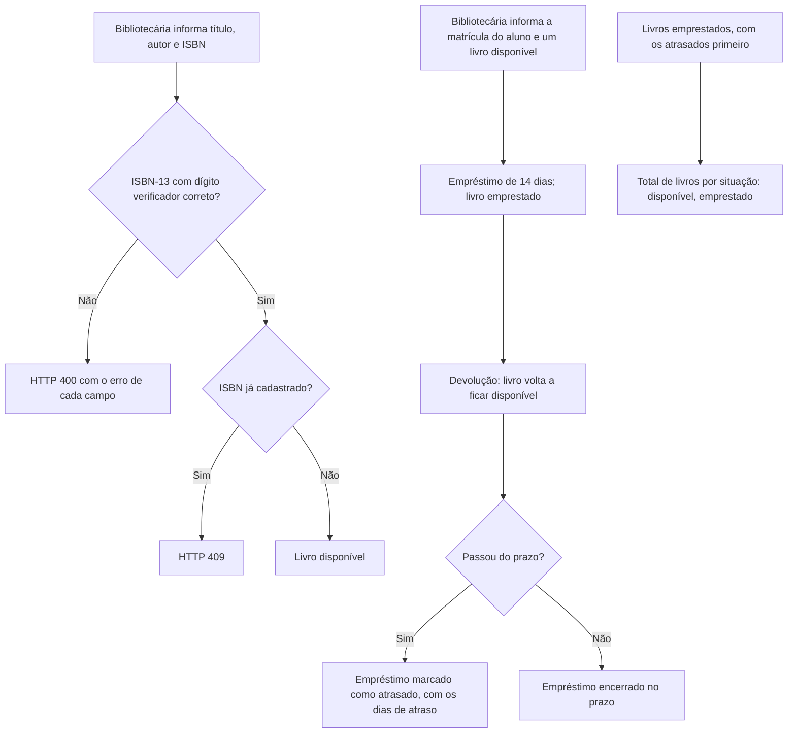

# Fluxo da biblioteca

```mermaid
flowchart TD
%% 1. Cadastro de livros
  C0[Bibliotecária informa título, autor e ISBN] --> C1{ISBN-13 com dígito verificador correto?}
  C1 -- Não --> C2[HTTP 400 com o erro de cada campo]
  C1 -- Sim --> C3{ISBN já cadastrado?}
  C3 -- Sim --> C4[HTTP 409]
  C3 -- Não --> C5[Livro disponível]
%% 2. Empréstimos e devoluções
  E0[Bibliotecária informa a matrícula do aluno e um livro disponível] --> E1[Empréstimo de 14 dias; livro emprestado]
  E1 --> E2[Devolução: livro volta a ficar disponível]
  E2 --> E3{Passou do prazo?}
  E3 -- Sim --> E4[Empréstimo marcado como atrasado, com os dias de atraso]
  E3 -- Não --> E5[Empréstimo encerrado no prazo]
%% 3. Relatórios
  R0[Livros emprestados, com os atrasados primeiro] --> R1[Total de livros por situação: disponível, emprestado]
```
