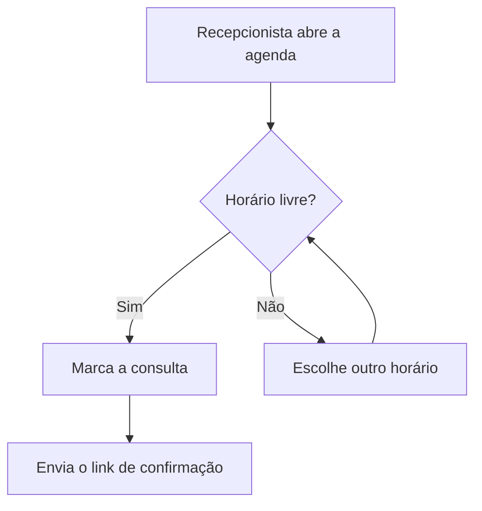

# Fluxo de agendamento

```mermaid
flowchart TD
  A[Recepcionista abre a agenda] --> B{Horário livre?}
  B -- Sim --> C[Marca a consulta]
  B -- Não --> D[Escolhe outro horário]
  D --> B
  C --> E[Envia o link de confirmação]
```

Dado que a agenda está aberta, quando o paciente confirma, então a consulta fica marcada.
